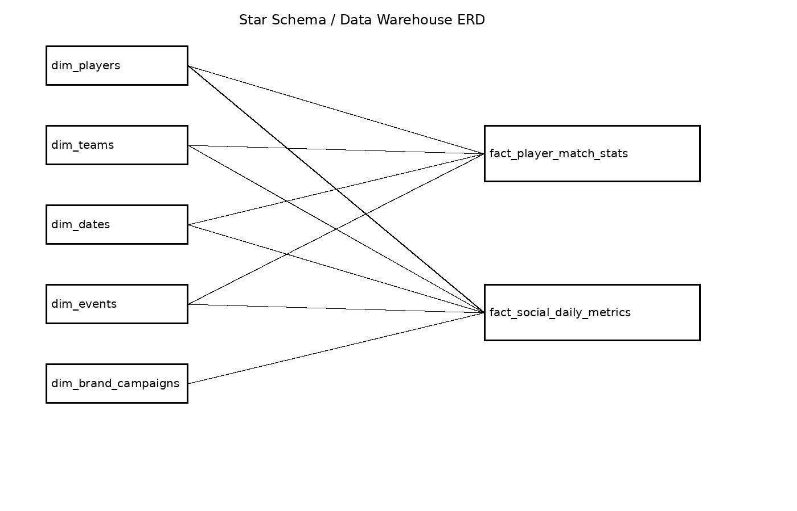

# 🏏 Athlete Brand Equity Engine


> Correlating IPL cricket player performance with social media influence
> to identify overrated vs underrated players for fantasy sports and brand valuation.

---

## 🧠 Problem Statement

Most sports analytics looks at match stats in isolation.
Most social media analytics looks at followers in isolation.
This project connects both — modeling a player's true market value
using performance AND public influence data.

---

## 🏗️ Tech Stack

| Layer | Tool |
|-------|------|
| Database | PostgreSQL 15 |
| Transformation | dbt Core |
| Data Generation | Python 3.11 |
| Orchestration | Apache Airflow (coming soon) |
| Visualization | Metabase (coming soon) |
| Version Control | Git + GitHub |

---

## 📁 Project Structure
athlete-brand-equity-engine/
├── sql/
│   ├── schema/        → Database DDL
│   └── analyses/      → Advanced SQL queries
├── data_generator/    → Python data scripts
├── data/              → CSV files (git-ignored)
├── dbt/               → dbt models and tests
└── docs/              → Architecture diagrams
---

## 🚀 Status

- [x] Project setup and folder structure
- [ ] Schema design (star schema)
- [ ] Data generation / Kaggle transformation
- [ ] SQL analyses (window functions, CTEs)
- [ ] dbt models and tests
- [ ] Metabase dashboard

---

## 🗄️ Schema Design

The project follows a star-schema architecture consisting of dimension tables and fact tables.
## Why Star Schema?

A flat table containing player information, team information, match statistics, social metrics, and campaign details would result in:

- Data duplication
- Increased storage requirements
- Slower analytical queries
- Difficult maintenance
- Poor scalability

The star schema separates descriptive attributes into dimension tables and measurable business events into fact tables.

### Benefits

- Reduced data redundancy
- Better query performance
- Easier maintenance
- Clear analytical structure
- Industry-standard data warehouse design
- Compatible with BI tools such as Metabase, Power BI, and Tableau

---

### Dimension Tables

#### dim_players
Stores player information.

#### dim_teams
Stores IPL team information.

#### dim_events
Stores player-related events.

#### dim_brand_campaigns
Stores sponsorship and campaign information.

#### dim_dates
Stores calendar date information for time-series analytics.

### Fact Tables

#### fact_player_match_stats

Stores player-level match performance metrics.

##### Batting Metrics

- Runs Scored
- Balls Faced
- Fours
- Sixes
- Strike Rate
- Batting Position
- Dismissal Type

##### Bowling Metrics

- Overs Bowled
- Wickets Taken
- Runs Conceded
- Economy Rate
- Dot Balls

##### Fielding Metrics

- Catches
- Run Outs

##### Match Information

- Match Date
- IPL Season
- Venue
- Match Result
- Player of the Match

---

#### fact_social_daily_metrics

Stores player social media performance by platform and date.

##### Growth Metrics

- Followers
- Follower Delta
- Follower Growth Percentage

##### Engagement Metrics

- Posts Count
- Likes
- Comments
- Shares
- Engagement Rate

##### Sentiment Metrics

- Sentiment Score (-1 to 1)
- Trending Score (0–100)

---

### Database Constraints

#### Primary Keys

Implemented on all dimension and fact tables.

#### Foreign Keys

Implemented to maintain referential integrity between fact and dimension tables.

Examples:

- `player_id → dim_players`
- `team_id → dim_teams`
- `opponent_team_id → dim_teams`

#### Unique Constraints

Implemented:

```sql
UNIQUE(player_id, metric_date, platform)
```

Prevents duplicate social-media records for the same player on the same platform and date.

#### Check Constraints

Implemented:

```sql
CHECK(sentiment_score BETWEEN -1 AND 1);

CHECK(trending_score BETWEEN 0 AND 100);
```

---

## ⚡ Performance Optimization

Indexes were created to improve analytical query performance.

### Match Statistics Indexes

```sql
CREATE INDEX idx_match_stats_player
ON staging.fact_player_match_stats(player_id);

CREATE INDEX idx_match_stats_date
ON staging.fact_player_match_stats(match_date);

CREATE INDEX idx_match_stats_player_dt
ON staging.fact_player_match_stats(player_id, match_date);

CREATE INDEX idx_match_stats_season
ON staging.fact_player_match_stats(ipl_season);
```

### Social Metrics Indexes

```sql
CREATE INDEX idx_social_player
ON staging.fact_social_daily_metrics(player_id);

CREATE INDEX idx_social_date
ON staging.fact_social_daily_metrics(metric_date);

CREATE INDEX idx_social_platform
ON staging.fact_social_daily_metrics(platform);

CREATE INDEX idx_social_player_date
ON staging.fact_social_daily_metrics(player_id, metric_date);
```

---

## 📊 Schema Diagram



---

## ✅ Current Progress

- [x] Repository setup
- [x] PostgreSQL database created
- [x] Staging schema created
- [x] Star-schema design completed
- [x] Dimension tables created
- [x] Fact tables created
- [x] Primary keys implemented
- [x] Foreign keys implemented
- [x] Unique constraints implemented
- [x] Check constraints implemented
- [x] Indexes created and verified
- [x] Schema validated in PostgreSQL
- [x] Schema diagram added

---

## 🚀 Next Steps

- [ ] Generate player datasets
- [ ] Transform Kaggle datasets
- [ ] Load dimension tables
- [ ] Load fact tables
- [ ] Build analytical SQL queries
- [ ] Create dbt models
- [ ] Add dbt tests
- [ ] Build Metabase dashboards
- [ ] Create Airflow pipelines
- [ ] Deploy data pipeline

---

## 📄 License

MIT License

